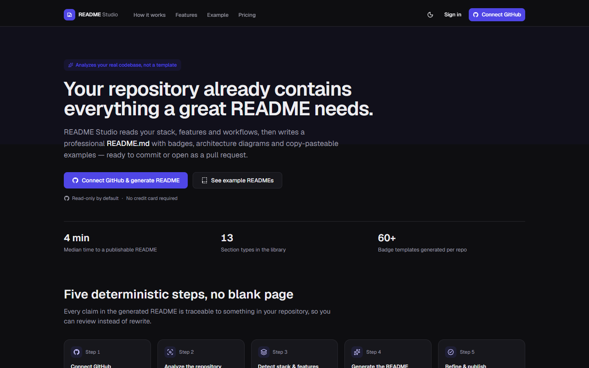
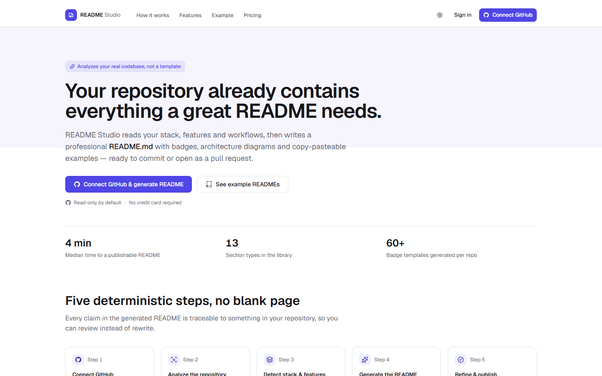
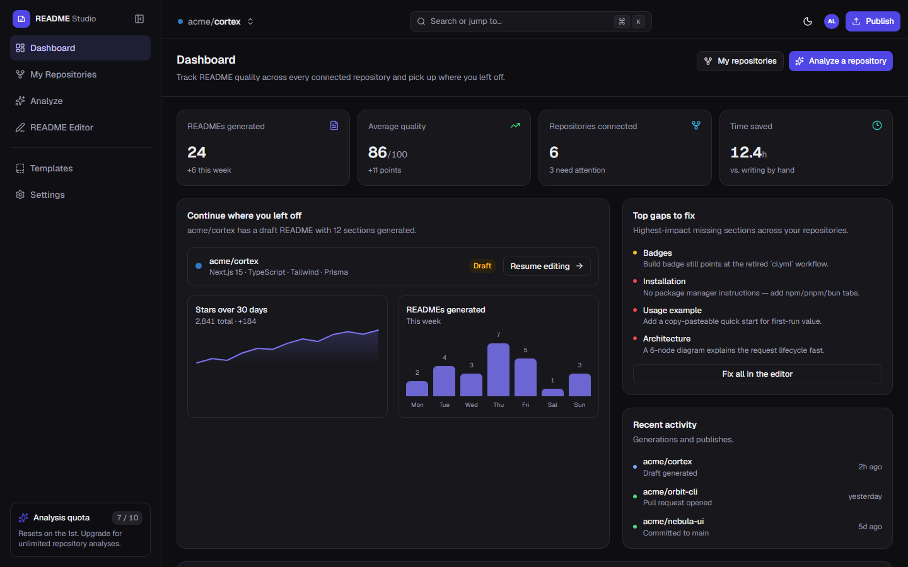
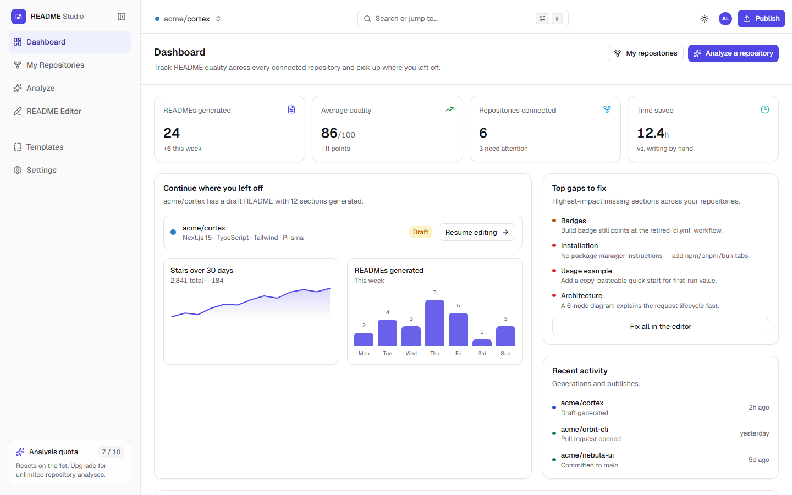
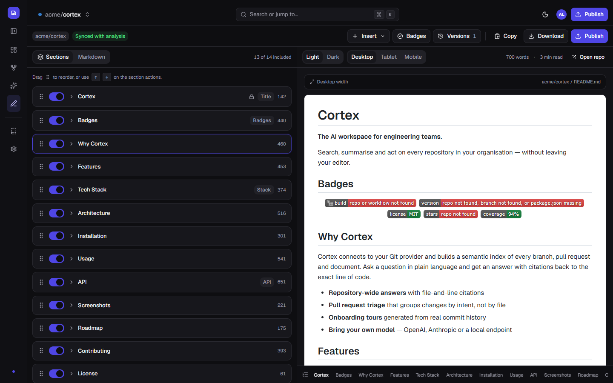
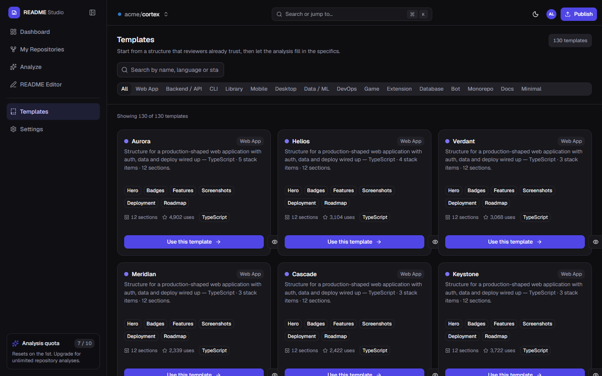
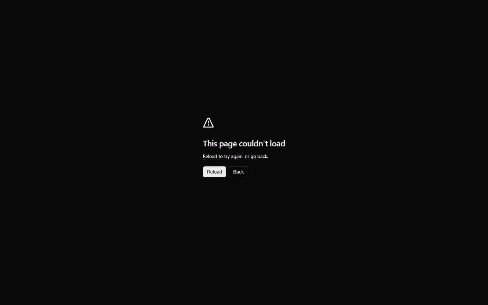
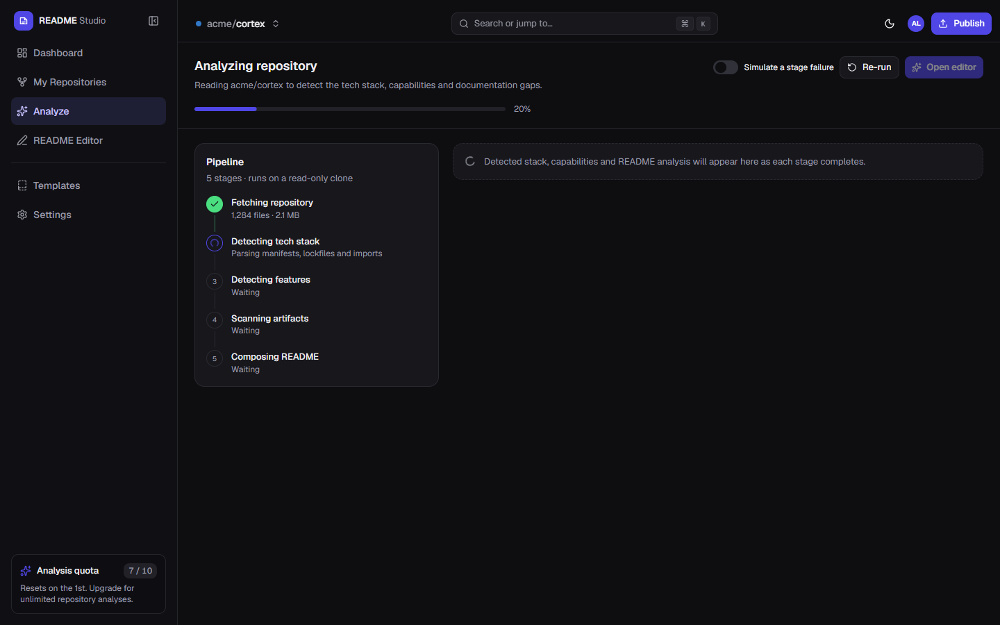
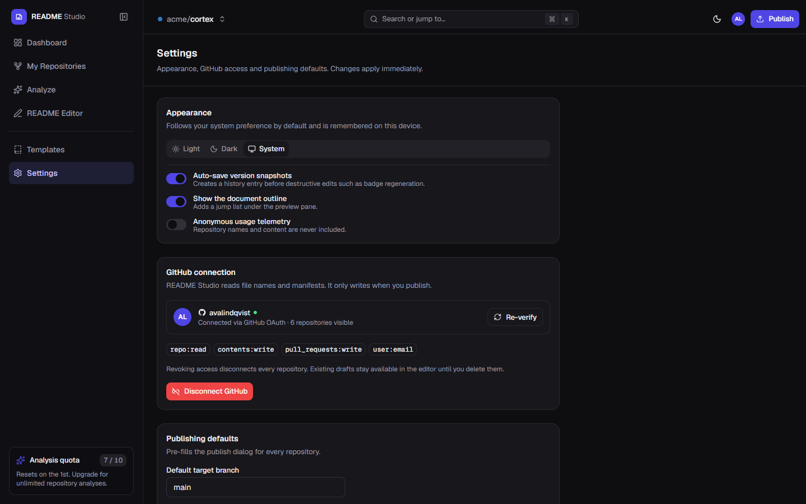

<div align="center">

# 

**Turn any repository into a README worth reading.**

Analyze a real codebase, pick from **130 curated templates**, refine in a dual-pane
editor with live GitHub-flavored preview, and publish — as a commit or a pull request.

[](https://nextjs.org)
[](https://react.dev)
[](https://www.typescriptlang.org)
[](https://tailwindcss.com)
[](LICENSE)
[](https://github.com/mohammadhossein-asadi/github-readme-studio/pulls)

[**Explore the app**](#-screenshots) · [**Features**](#-features) · [**Quick start**](#-quick-start) · [**Templates**](#-130-readme-templates)

<br/>



</div>

---

## ✨ What is this?

GitHub README Studio is a production-shaped Next.js SaaS that writes documentation the
way a senior engineer would: **every claim is traceable to something in your
repository**. A five-stage pipeline reads your manifests, routes, tests and workflows,
then hands you a structured draft you refine visually — no blank page, no copy-paste
boilerplate, no stale badges.

<table>
<tr>
<td width="50%">

### 🧠 Deterministic analysis
Five stages — fetch, detect stack, detect features, scan artifacts, compose — run on a
read-only clone with per-stage progress and failure simulation.

### ✍️ Editor that stays out of your way
Toggle, reorder and edit sections; watch the GitHub-flavored preview update live at
desktop, tablet and mobile widths; roll back through version history.

</td>
<td width="50%">

### 📊 Badges, charts & tech stack
One click for build, version, license, coverage and stars badges — plus star-history
charts and a detected tech-stack table.

### 🚀 Publish safely
Copy, download, commit to a branch, or open a pull request — every destructive action
guarded by an explicit confirmation dialog.

</td>
</tr>
</table>

## 📸 Screenshots

<details open>
<summary><b>Landing & dashboard</b></summary>

<br/>

<table>
<tr>
<td align="center"><b>Dark</b></td>
<td align="center"><b>Light</b></td>
</tr>
<tr>
<td></td>
<td></td>
</tr>
<tr>
<td align="center"><b>Dashboard — dark</b></td>
<td align="center"><b>Dashboard — light</b></td>
</tr>
<tr>
<td></td>
<td></td>
</tr>
</table>

</details>

<details open>
<summary><b>Editor & templates</b></summary>

<br/>

<table>
<tr>
<td align="center"><b>README editor — sections, tools & live preview</b></td>
</tr>
<tr>
<td></td>
</tr>
<tr>
<td align="center"><b>Template gallery — 130 templates, searchable by kind and language</b></td>
</tr>
<tr>
<td></td>
</tr>
</table>

</details>

<details open>
<summary><b>Repositories, analysis & settings</b></summary>

<br/>

<table>
<tr>
<td align="center"><b>Repository browser</b></td>
<td align="center"><b>Analysis pipeline</b></td>
</tr>
<tr>
<td></td>
<td></td>
</tr>
<tr>
<td align="center"><b colspan="2">Settings — appearance, GitHub access & publishing defaults</b></td>
</tr>
<tr>
<td colspan="2"></td>
</tr>
</table>

</details>

## 🧩 Features

- **GitHub connection & repository picker** — search, filter by visibility, sort by
  stars or recency, and inspect README quality scores before you start.
- **Progressive analysis pipeline** — five streamed stages with live progress,
  re-run support, and a toggle to simulate stage failures.
- **Dual-pane README editor** — section toggles with drag-to-reorder, a raw markdown
  mode with syntax highlighting, and a live GFM preview (tables, task lists, footnotes,
  raw HTML) with responsive viewport presets.
- **Badges studio** — shields.io badges for build, version, license, stars and
  coverage, generated from the detected stack.
- **Insert library** — features, tech-stack tables, architecture diagrams, API
  references, screenshots and roadmaps in one click.
- **AI rewrite assists** — polish, shorten, tighten and expand actions on any section.
- **Version history** — auto-saved snapshots with diff-friendly restore.
- **Publish flow** — copy, download `.md`, commit to a branch or open a PR, each behind
  an explicit confirmation dialog with permission warnings.
- **Command palette** — `⌘K` navigation across repositories, sections and actions.
- **130 README templates** across 15 project kinds, each with a complete document
  (hero, badges, features, install, usage, kind-specific extras).
- **Dark & light themes** — system-aware, remembered per device, contrast-checked to
  WCAG AA.
- **Responsive & accessible** — mobile drawer navigation, safe-area insets, focus
  rings, skip links, skeleton loading states, and `aria-live` status regions.

## 🗂 Screenshots index

| Section | Route | Screenshot |
| --- | --- | --- |
| Landing page | `/` | `docs/screenshots/landing-{dark,light}.png` |
| Dashboard | `/dashboard` | `docs/screenshots/dashboard-{dark,light}.png` |
| Repositories | `/repos` | `docs/screenshots/repos-dark.png` |
| Analysis | `/analyze` | `docs/screenshots/analyze-dark.png` |
| Editor | `/editor` | `docs/screenshots/editor-{dark,light}.png` |
| Templates | `/templates` | `docs/screenshots/templates-{dark,light}.png` |
| Settings | `/settings` | `docs/screenshots/settings-dark.png` |

## 🧱 Tech stack

| Layer | Choices |
| --- | --- |
| Framework | Next.js 16 (App Router, Turbopack), React 19 |
| Styling | Tailwind CSS v4, `tw-animate-css`, CSS-first design tokens |
| Components | Radix UI primitives, cmdk, sonner, react-resizable-panels v4 |
| Markdown | react-markdown + remark-gfm + rehype-raw, CodeMirror 6 |
| Motion & icons | motion, lucide-react |
| Quality | TypeScript 5, ESLint 9 (`eslint-config-next`) |

## 🚀 Quick start

```bash
git clone https://github.com/mohammadhossein-asadi/github-readme-studio.git
cd github-readme-studio
npm install
npm run dev
```

Open [http://localhost:3000](http://localhost:3000) — the landing page greets you, then
head to **Templates** or **Connect GitHub** to reach the editor.

```bash
npm run build   # production build (12 routes, fully static where possible)
npm start       # serve the production build
npm run lint    # ESLint
```

## 📁 Project structure

```
src/
├── app/
│   ├── page.tsx              # Landing page
│   └── (app)/                # Authenticated shell
│       ├── dashboard/        # Metrics, charts, gaps, activity
│       ├── repos/            # Repository browser & queueing
│       ├── analyze/          # Five-stage pipeline UI
│       ├── editor/           # Dual-pane README editor
│       ├── templates/        # 130-template gallery
│       └── settings/         # Appearance, GitHub, publishing
├── components/
│   ├── app-shell/            # Sidebar, topbar, command palette, providers
│   ├── editor/               # Sections, preview, badges, versions, publish
│   ├── landing/              # Marketing sections
│   └── ui/                   # Accessible primitives (Radix + CVA)
└── lib/
    ├── mock/                 # Repos, analysis results, 130 template seeds
    └── *.ts                  # Utilities, types, workspace state
```

## ✅ Verified

```bash
npx tsc --noEmit   # clean
npx eslint .       # clean
npm run build      # 12/12 routes
```

## 📄 License

MIT — see [LICENSE](LICENSE).
